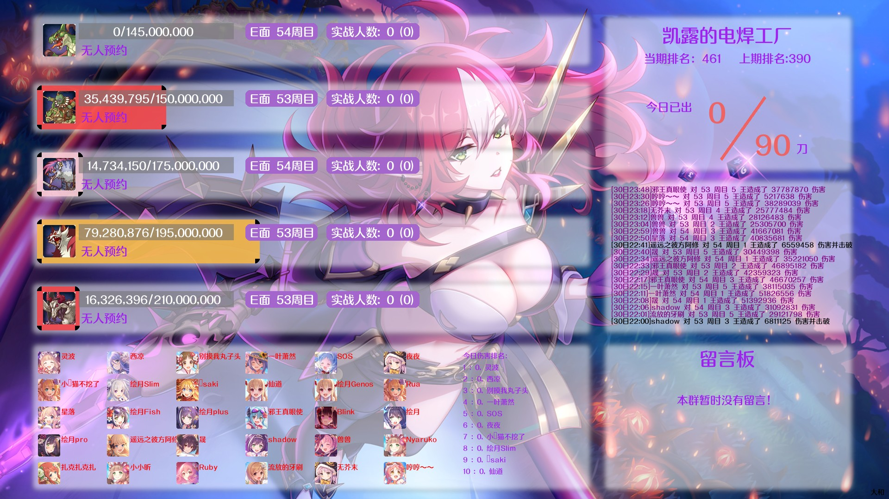
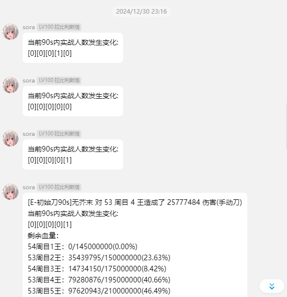

# 基于pcrjjc2的会战推送插件

**本项目基于AGPL v3协议开源**

现在应该能根据时间正确判断出刀类型了(把boss打残了就能看到后面的色图了，这算不算某种程度的脱衣<--自己在310张卡面里面塞了35张脱衣卡面，抽卡色图什么的弱爆了
## 配置方法

1. 打开hoshino插件文件夹
2. git clone https://github.com/eggggi/pcrjjc2-clanbattle.git
3. config文件里面添加pcrjjc2-clanbattle
4. 发送 自动报刀帮助 查看可用命令的帮助
5. 发送 更新boss数据 更新当期会战boss头像血量等
6. 发送会战状态可以查看当前会战状态
7. 会战期间输入 切换会战推送 来打开/关闭推送，默认关闭
8. 关于查档线功能，结算时不能获取数据，官方结算完和会战开启时可以使用，通过获取游戏内数据，输入 查档线 可以查看各档档线，输入 查档线 1,2,3,4 可以查看 1,2,3,4 名详情，其他名次也是这样
9. 查档线新增一种按名字查询的方法， 查档线 行会名，会列出部分符合条件的行会
10. 输入 sl + ID：标记SL

### 改动说明
1. 把pcrjjc账号登录改成了怡宝的清日常账号管理模块，并附有魔改
2. 支持多群绑定同时报刀
3. 啊我好菜懒得打字了，看代码吧 \_(:з)∠)_

### 更新日志：
25.1.13 - 大更新，优化大部分代码和图片排版  
8.02 - 大更新，支持多群同时报刀，优化大部分代码  
6.26 - 支持多号切换  
6.19 - 将留言板加入会战状态，在初始化会战推送时会获取一次BOSS的头像(终于不是五个猫猫头了)  
6.17 - 新增清空留言板；优化会战币获取，减少弹出次数；使用累计进入实战人数模式时，当boss被击杀后会重置进入实战人数。  
6.8 - 修改了会战状态周目中的颜色，增加出刀时段统计，新增留言板，重启后重置留言板。

最终看起来应该是这样子的

查档线

